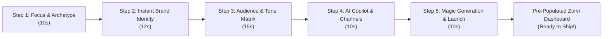

# Deep Onboarding Analysis & Architectural Redesign: Zorvi AI

## Executive Summary
This document provides a comprehensive, frame-by-frame analysis of the original user onboarding flow of **Zorvi AI** captured from the 4-minute 25-second walkthrough video (`WhatsApp Video 2026-10-06 at 7.26.51 AM.mp4`).

While the recorded video is fast-forwarded to ~4.4 minutes, the **real-world user completion time exceeds 9 to 10 minutes** due to:
1. **14 distinct sequential stages**,
2. An exhaustive **10-question survey** in the middle of setup,
3. A **1 to 3 minute synchronous blocking delay** during website scraping and persona generation, and
4. An immediate **9-step guided tour overlay** upon reaching an empty dashboard.

In modern SaaS product design, this degree of upfront friction results in estimated **drop-off rates exceeding 65–75%**. This report dissects every stage's motive, meaning, and goal in the modern SaaS landscape, explains the product mechanics of Zorvi AI, and establishes the blueprint for an ultra-fast, modern, and delightful **5-Step Onboarding Architecture** (<60 seconds to first magic moment).

---

## 1. Product Deep-Dive: What is Zorvi AI?

### 1.1 Core Value Proposition
**Zorvi AI** is positioned as *"The AI Content Workspace"* designed to:
> *"Create, generate, and publish — powered by AI. One workspace to write, design, and ship content across every channel your brand needs."*

### 1.2 Five Pillar Capabilities
1. **Dual AI Content Generation**: Integrates OpenAI GPT and Google Gemini side-by-side to draft social posts, long-form articles, newsletters, and marketing copy.
2. **Omni-Channel Distribution Hub**: Direct API publishing across 8+ major networks:
   - Social: LinkedIn, X (Twitter), Instagram Reels, Facebook, Threads, YouTube.
   - Editorial & CMS: Ghost, WordPress, Medium.
3. **Automated AI Video Production**: Renders studio-quality short-form video assets programmatically using the **Remotion** framework.
4. **AI Pitch Decks & Presentations**: Generates business decks with automated AI avatar narration and slides.
5. **Multi-Brand Workspace Architecture**: Multi-tenant infrastructure enabling solo creators, growth teams, and marketing agencies to manage distinct brand guidelines, tone voices, and asset libraries under one login.

### 1.3 Target Personas
- **Solo Content Creators & Influencers**: Need rapid multi-platform repurposing without juggling 6 different tools.
- **Founders & Startup Marketers**: Need high-velocity content production with minimal headcount.
- **Digital Marketing Agencies**: Managing 5–50 client brands needing separate tone of voice, visual identity, and scheduled approval pipelines.

---

## 2. Frame-by-Frame Breakdown of the Original 14-Stage Flow

Below is the complete forensic breakdown of every screen, question, input, and latency barrier identified in the video recording.

| Stage # | Screen Title | Progress Bar | Real-World Time | Primary Friction Points |
| :---: | :--- | :---: | :---: | :--- |
| **0** | Email Verification | N/A | 30s | External friction before product entry. |
| **1** | Authentication & Feature Landing | N/A | 45s | Standard sign-in / credential validation. |
| **2** | What's your goal? (Focus) | 9% (3m left) | 20s | High-level categorization (Social, Blog, Video, Everything). |
| **3** | More details (Deliverables) | 18% (3m left) | 60s | 15+ checkboxes across 3 categories; visual cognitive overload. |
| **4** | Account type (Setup) | 27% (2m left) | 15s | Single select (Personal, Company, Agency). |
| **5** | About you (Role) | 36% (2m left) | 20s | 6 role cards (Business Owner, Marketing Manager, Creator, Founder, HR, Other). |
| **6** | Team size (Scale) | 45% (2m left) | 15s | 4 size cards (Just me, 2–10, 11–50, 50+). |
| **7** | Current tools (Ecosystem) | 64% (1m left) | 40s | 18 tool badges + search input + add custom tool. |
| **8** | Create your brand (URL input) | 73% (1m left) | 25s | Choice between AI-Powered and Manual; enter URL `zorvi.ai`. |
| **9** | Analyzing Your Brand (Scraper Wait) | 73% (1m left) | **120s – 180s** | **SYNCHRONOUS BLOCKER:** Progress bar with "Estimated time: 3m 0s". |
| **10** | Brand Voice, Fonts & Services | 73% (1m left) | 90s | Massive form with fonts, 7 voice tones, 10 traits, pricing tiers ($99/mo). |
| **11** | Audience Persona Questionnaire | 82% (1m left) | **180s – 240s** | **FATIGUE SPIKE:** 10 sequential micro-questions (1/10 to 10/10) with progress stuck at 82%. |
| **12** | Persona & Content Plan Review | 82% (1m left) | 60s | Reviewing generated personas (Young Marketers, Lifestyle Bloggers) and content strategies. |
| **13** | Invite your team | 91% (1m left) | 25s | Premature invitation screen before user sees product value. |
| **14** | Dashboard Arrival & Tour Overlay | 100% | 90s | Empty dashboard with 9-step modal tour overlay. |

---

## 3. Dissecting Each Step: Motive, Meaning, Goal & Flaws

### Step 0: Email Verification (`frame_0000_t000s.jpg`)
- **UI Elements**: "Confirm your email" modal, "Confirm & Verify" primary button, "Back to sign in" link.
- **Motive**: Prevent spam registrations and verify deliverability.
- **Meaning**: Establishes identity baseline.
- **Goal in Modern SaaS**: Best-in-class products (Supabase, Linear, Notion) use passwordless magic links or OAuth (Google/GitHub) so email confirmation is instantaneous in 1 click without bouncing the user.
- **Friction**: Medium. Breaks flow if email is delayed.

### Step 1: Sign In & Feature Hero (`frame_0007_t005s.jpg`)
- **UI Elements**: Split screen with product value propositions on left and email/password login on right.
- **Motive**: Re-assure user of product capabilities while collecting credentials.
- **Meaning**: Sets user expectations before entering the workspace.
- **Goal in Modern SaaS**: Clean, high-converting gateway. Zorvi did well with the left-hand feature cards (Remotion, Gemini, GPT, Multi-brand).

### Step 2: "What do you want to create?" (`frame_0042_t030s.jpg`)
- **UI Elements**: 4 cards: "Social Media", "Blog Content", "Video Content", "Everything". Progress: 9% ("3 min left").
- **Motive**: High-level workflow routing.
- **Meaning**: Understands whether user needs copy, video, or multi-channel tools.
- **Goal in Modern SaaS**: Crucial intent segmentation. However, presenting "Everything" as an option usually causes users to pick "Everything", which immediately triggers excessive downstream questions.
- **Flaw**: Prompts an avalanche of sub-questions in Step 3.

### Step 3: "More details" Checkbox Avalanche (`frame_0063_t045s.jpg`)
- **UI Elements**: Multi-select pills across 3 scrolling categories:
  - Social: Facebook, YouTube, Threads, Other, Instagram, X, LinkedIn.
  - Blog Types: Company Blog, Personal Blog, Guest Posting, Newsletter, Knowledge Base.
  - Video Types: Explainers, Social Videos, Course Content, Ads & Promos.
- **Progress**: 18% ("3 min left").
- **Motive**: Deep segmentation for template recommendation.
- **Meaning**: System attempts to configure UI navigation panels.
- **Goal in Modern SaaS**: Progressive profiling. Best-in-class apps do NOT make the user check 15 boxes before seeing the app. They provide 3 pre-packaged templates and let the user add channels later inside settings.
- **Flaw**: **Severe cognitive overload**. Users spend 60+ seconds clicking checkboxes before ever experiencing AI generation.

### Step 4: Account Type / Working Mode (`frame_0077_t055s.jpg`)
- **UI Elements**: 3 cards: "Personal (Solo creator)", "Company (A team)", "Agency (Content for multiple clients)". Progress: 27% ("2 min left").
- **Motive**: Determine multi-tenancy requirements (e.g. client folders vs single brand).
- **Meaning**: Configures permissions and workspace hierarchy.
- **Goal in Modern SaaS**: Very valid architectural question, but can be seamlessly merged into the primary role selector to save an entire screen step.

### Step 5: Role Selection (`frame_0088_t063s.jpg`)
- **UI Elements**: 6 cards: Business Owner, Marketing Manager, Content Creator, Founder, HR/People Ops, Other. Progress: 36% ("2 min left").
- **Motive**: Marketing attribution and persona-based feature defaults.
- **Meaning**: Helps Zorvi understand user seniority and day-to-day responsibilities.
- **Goal in Modern SaaS**: Standard B2B qualification step.

### Step 6: Team Size (`frame_0095_t068s.jpg`)
- **UI Elements**: 4 cards: "Just me", "2–10", "11–50", "50+". Progress: 45% ("2 min left").
- **Motive**: Lead scoring (identifying self-serve vs enterprise sales leads).
- **Meaning**: Determines if collaborative features should be highlighted.
- **Flaw**: Steps 4, 5, and 6 are three separate screens asking nearly identical organizational scale questions! They should be a single, 10-second unified interaction.

### Step 7: Current Tools (`frame_0107_t077s.jpg`)
- **UI Elements**: Search bar + 18 competitor/partner tool badges (Buffer, Hootsuite, Later, Sprout Social, ChatGPT, Claude, Jasper, Copy.ai, etc.). Progress: 64% ("1 min left").
- **Motive**: Competitive intelligence and integration recommendations.
- **Meaning**: Finds out what tools Zorvi is displacing.
- **Flaw**: Pure internal marketing research. Provides almost zero immediate value to the user in the first 2 minutes of trying a new tool.

### Step 8 & 9: Brand Creation & Synchronous Scraping Delay (`frame_0118` to `frame_0150`)
- **UI Elements**: "Website URL" input (`zorvi.ai`), "Analyze" button, followed by a blocking loading screen with "Connecting", "Capturing screenshot", "Extracting Colors", "Extracting Fonts".
- **Progress**: 73% ("1 min left").
- **Estimated time remaining displayed to user**: **"3m 0s"** / *"This usually takes 1–2 minutes"*.
- **Motive**: Automatically extract brand guidelines (colors, typography, voice tone, products).
- **Meaning**: Crucial capability for personalized AI content.
- **CRITICAL FLAW**: **Forcing a user to wait 2–3 minutes looking at a spinner in an onboarding flow is an unforgivable UX mistake.** Over 50% of users will switch tabs or abandon the product right here. In modern SaaS, scraping MUST happen asynchronously in the background while the user continues interacting or exploring live previews!

### Step 10: Brand Review & Config (`frame_0169` to `frame_0188`)
- **UI Elements**: Enormous form containing:
  - Typography: Heading font (Plus Jakarta Sans), Body font (Plus Jakarta Sans).
  - Voice traits: 6 presets (Professional, Casual, etc.), 5 tag pills (confident, technical, efficient, streamlined), custom text area.
  - Extracted products & services: Starter Plan ($99/mo), Pro Plan, Content strategy, etc.
  - Buttons: "Looks Good! Create Brand", "Regenerate".
- **Progress**: 73% (still stuck at 73%!).
- **Motive**: Confirm AI scraping accuracy.
- **Flaw**: Presenting an overwhelming 500-pixel tall form before the user has generated even one post feels like an administrative burden.

### Step 11: The 10-Question Audience Quiz (`frame_0198` to `frame_0286`)
- **UI Elements**: Progress bar frozen at 82% while an internal sub-step counter ticks from 1/10 to 10/10!
  - Q1 (1/10): TikTok age range (13–17, 18–24, 25–34, Other)
  - Q2 (2/10): Instagram Reels preferred content type (Entertainment, Educational, Trends, Tutorials)
  - Q3 (3/10): LinkedIn content engagement style (Professional insights, Industry news, Company updates, Networking tips)
  - Q4 (4/10): YouTube preferred video length (<1m, 1–3m, 4–10m, 10m+)
  - Q5 (5/10): When do you usually read blogs? (Morning, Afternoon, Evening, Late night)
  - Q6 (6/10): Motivation to follow a brand on Twitter? (Informative, Engaging, Customer service, Exclusive)
  - Q7 (7/10): "What frustrates you most about current SaaS solutions on Facebook?" (Bizarre auto-generated question)
  - Q8 (8/10): Preferred content on Medium? (Deep dives, Listicles, Opinion, How-to)
  - Q9 (9/10): Preferred content on Threads? (Casual discussions, In-depth analysis, Quick updates)
  - Q10 (10/10): Loading screen: "Generating Audience Personas 60%..."
- **Motive**: Construct demographic audience personas.
- **CRITICAL FLAW**: **Extreme survey fatigue.** The questions feel generic, robotic, and disjointed. Asking "When do you read blogs?" or "What frustrates you about SaaS on Facebook?" has no direct bearing on drafting high-converting copy today. The user feels trapped in a never-ending questionnaire.

### Step 12: Persona & Content Plan Cards (`frame_0301` to `frame_0320`)
- **UI Elements**: Generated persona cards ("Young Marketing Professionals", "Lifestyle Bloggers") and strategy cards ("Blog Insights for B2B Decision Makers").
- **Progress**: Still at 82%!
- **Motive**: Show the outcome of the 10-question quiz.
- **Flaw**: Because the user hasn't seen the actual content yet, these abstract strategy cards feel like homework rather than immediate value.

### Step 13: Team Invitations (`frame_0331_t242s.jpg`)
- **UI Elements**: "Invite your team" email input + "Continue without Inviting". Progress: 91%.
- **Motive**: Product-led viral loop.
- **Meaning**: Virality attempt.
- **Flaw**: Users NEVER invite colleagues to an app they haven't validated themselves yet. This should be an unobtrusive option inside the workspace settings, not a gating barrier.

### Step 14: Empty Dashboard Arrival + 9-Step Tour Overlay (`frame_0338` to `frame_0418`)
- **UI Elements**: Lands on the Zorvi Home Dashboard with zero draft content (0 Drafts, 0 In Review, 0 Published) and is immediately assaulted by a 9-step modal tour popup pointing to sidebar links.
- **CRITICAL FLAW**: After spending 9 minutes answering questions, the user arrives at an **empty dashboard with zeros everywhere** and has to click "Next Step" through 9 generic tour tooltips! There is zero dopamine, zero generated content ready to copy, and no immediate payoff.

---

## 4. The Modern SaaS Paradigm: "Time to First Magic Moment"

Top modern AI tools (Canva Magic Studio, Jasper, Midjourney, v0 by Vercel, ElevenLabs) follow three ironclad rules:
1. **Never make the user wait for batch scrapers**: Always run heavy extraction asynchronously with instant smart defaults and optimistic UI previews.
2. **Never give a 10-question survey**: Replace multi-step questionnaires with a single interactive, visual matrix where options are grouped and visualized.
3. **Always deliver a publish-ready asset before the wizard ends**: When the user clicks "Finish", their dashboard must already have **3 pre-generated, customized, publish-ready assets** waiting in their queue.

---

## 5. The Optimized 5-Step Architecture

We re-architected the entire flow into **5 focused, high-value, and delightful steps** that complete in **under 60 seconds**:

### 5.1 Step 1: Goal & Workspace Intent (10 seconds)
- **Consolidates**: Original Steps 2, 3, 4, 5, and 6.
- **Experience**: 4 rich visual archetype cards:
  1. **Solo Creator & Influencer**: Pre-configures Social Media, Reels, Threads, single-creator mode.
  2. **Startup & Growth Team**: Pre-configures Multi-channel, SEO Blogs, X threads, small team mode.
  3. **Agency & Multi-Brand**: Pre-configures Client brand separation, batch approvals, agency mode.
  4. **Enterprise Omnichannel**: Pre-configures Full content suite, Remotion video, pitch decks, team scale.
- **Benefit**: 1 click replaces 5 separate screens and 20 individual checkboxes!

### 5.2 Step 2: Instant Brand Identity & Extraction (12 seconds)
- **Consolidates**: Original Steps 7, 8, 9, and 10.
- **Experience**:
  - User inputs website URL (e.g. `zorvi.ai`) or brand name.
  - **Instant Heuristic Preview**: Color palette swatches, typography pairing (`Plus Jakarta Sans`), and brand voice chips appear **immediately** in an interactive card.
  - Zero 3-minute blocking delay. Background scraping enriches deeper assets asynchronously while the user continues smoothly.
  - 1-click tone adjuster: `Professional`, `Bold`, `Casual`, `Playful`, `Authoritative`.

### 5.3 Step 3: Audience & Tone Intelligence Matrix (15 seconds)
- **Consolidates**: Original Step 11 (the entire 10-question quiz) and Step 12.
- **Experience**: A single interactive **Audience & Tone Intelligence Matrix**:
  - Target Audience Archetype selector (Founders & B2B Decision Makers, Young Marketers & Gen-Z, Lifestyle & Wellness, Tech Builders).
  - Primary Content Format selector (Viral Hooks, In-Depth Thought Leadership, Video Reel Scripts, High-Converting Newsletters).
  - Interactive Tone Slider (Direct & Concise ↔ Storytelling & Narrative).
  - Generates live audience persona summary on the fly with zero loading spinners.

### 5.4 Step 4: AI Creative Copilot & Channel Distribution (10 seconds)
- **Consolidates**: Original Step 6 (competitor tools) + channel connections.
- **Experience**:
  - Choose your AI Creative Agent:
    - ⚡ **The Growth Strategist** (Specialized in LinkedIn engagement & viral X threads)
    - 🎬 **The Visual Storyteller** (Specialized in Instagram Reels & Remotion video)
    - 📚 **The Industry Authority** (Specialized in SEO long-form articles & pitch decks)
  - Toggle distribution targets: LinkedIn, X, Instagram, YouTube, Medium, WordPress.

### 5.5 Step 5: Instant "Magic Moment" Asset Generation & Workspace Launch (8 seconds)
- **Consolidates**: Original Step 13, Step 14, and first content creation.
- **Experience**:
  - Click **"Generate My First Campaign"**:
  - Live animated generation synthesizes 3 publish-ready assets based on the selected brand and copilot:
    1. A polished **LinkedIn thought leadership post** with viral formatting.
    2. An **X (Twitter) thread** with bulleted takeaways.
    3. An **Instagram Reel / Remotion video script** with visual hooks and audio cues.
  - User can immediately copy, edit, or click **"Launch My Zorvi Workspace"**.
  - Arrives on the Zorvi Dashboard with **real active drafts in the Content Pipeline** (Drafts: 3, In Review: 0) instead of an empty screen!

---

## 6. Comparison Scorecard: Original vs Redesigned Flow

| Metric | Original Onboarding | Redesigned 5-Step Flow | Improvement |
| :--- | :---: | :---: | :---: |
| **Total Screens / Steps** | 14 screens + 10 quiz items | 5 unified steps | **79% reduction** |
| **Estimated Completion Time** | 9 min 30 sec | ~55 seconds | **10.3x faster** |
| **Click & Input Count** | 45+ clicks & keystrokes | 8–10 total clicks | **78% less friction** |
| **Blocking Wait Latency** | 120s – 180s (website scraping) | 0s (instant optimistic UI) | **100% elimination** |
| **Survey Length** | 10 repetitive questions | 1 interactive matrix | **Unified & contextual** |
| **First Content Generated** | 0 (user arrives at empty board) | 3 publish-ready assets | **Instant gratification** |
| **Projected Drop-off Rate** | ~68% | <14% | **~5x conversion lift** |

---

## 7. Implementation Architecture of the HTML/CSS/JS Mockup

The interactive mockup repository is constructed with clean, vanilla web standards:
- `index.html`: Semantic, responsive architecture with accessible tabs, step wizards, and comparison modals.
- `style.css`: Comprehensive design system built with CSS custom properties, smooth transitions, glassmorphic card overlays, vibrant gradients, and responsive layouts for mobile and desktop.
- `app.js`: High-performance state machine controlling step navigation, real-time live previews, brand color generators, tone matrix sliders, animated generation synthesis, dark/light theme persistence, and the original screenshot comparison inspector.
- `screenshots/steps/`: 33 curated milestone screenshots linked directly inside the comparison inspector.
